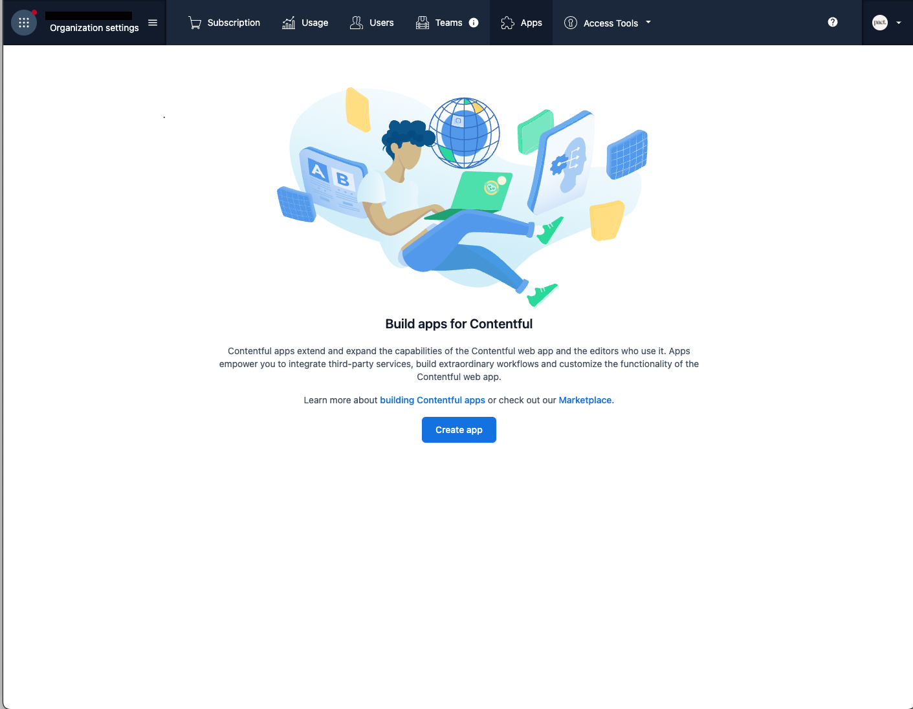
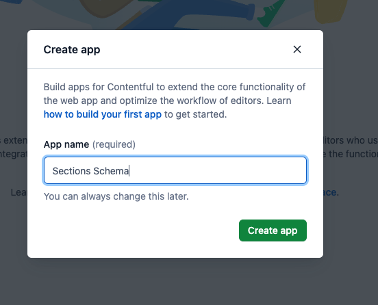
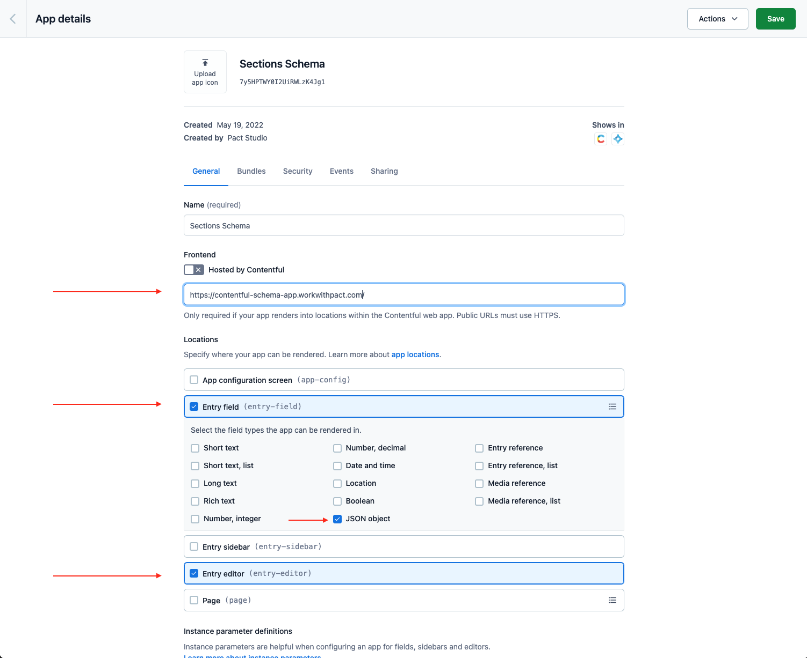
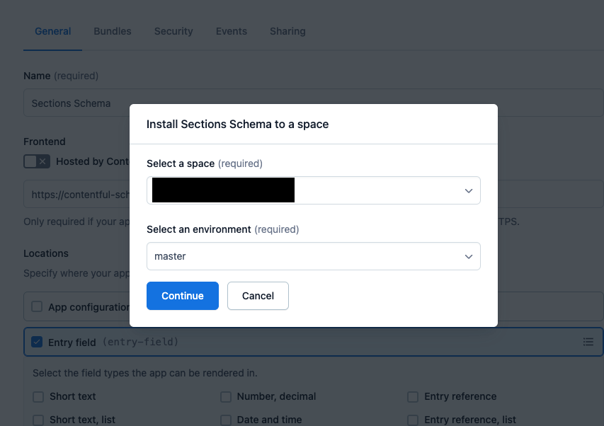
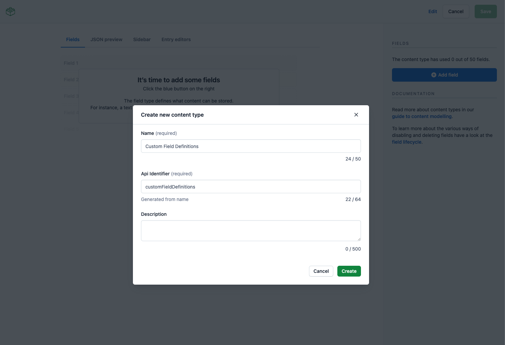

# Pact's Contentful Schema App

## What is this?
At [Pact](https://workwithpact.com/), we build a lot of Shopify sites. So much so, that we grew to think and speak in Shopify terms.
We also build quite a few headless sites, leveraging Gatsby and Contentful.

While Contentful is a very pwoerful and flexible platform, it's also kind of limiting in terms of how many Content Types you can create.

We decided to apply Shopify's Settings Schema logic to Contentful.

## How do I install it?
Simple! 

Head over to your Contentful Organization's Apps page and click Create app:


Give you app a name. Any name works! Then click "Create app".


In the app configuration screen, make sure to:
- Put in `https://contentful-schema-app.workwithpact.com/` as the public URL.
- Select the "Entry field" location, as well as the "JSON object" field
- Select the "Entry editor" location
- Click Save



Next, click on actions -> Install to Space -> select your space and environment -> Continue


Now, it't time to create a new Content Type. From your Space, head over to `Content model` and click on `Add content type`
Give it the name `Custom Field Definitions` and the API identifier `customFieldDefinitions`. Create it.

Next, add a `title` field of `Text` type.



## 

This project was bootstrapped with [Create Contentful App](https://github.com/contentful/create-contentful-app).

## Available Scripts

In the project directory, you can run:

#### `npm start`

Creates or updates your app definition in Contentful, and runs the app in development mode.
Open your app to view it in the browser.

The page will reload if you make edits.
You will also see any lint errors in the console.

#### `npm run build`

Builds the app for production to the `build` folder.
It correctly bundles React in production mode and optimizes the build for the best performance.

The build is minified and the filenames include the hashes.
Your app is ready to be deployed!

#### `npm run upload`

Uploads the build folder to contentful and creates a bundle that is automatically activated.
The command guides you through the deployment process and asks for all required arguments.
Read [here](https://www.contentful.com/developers/docs/extensibility/app-framework/create-contentful-app/#deploy-with-contentful) for more information about the deployment process.

#### `npm run upload-ci`

Similar to `npm run upload` it will upload your app to contentful and activate it. The only difference is   
that with this command all required arguments are read from the environment variables, for example when you add
the upload command to your CI pipeline.

For this command to work, the following environment variables must be set: 

- `CONTENTFUL_ORG_ID` - The ID of your organization
- `CONTENTFUL_APP_DEF_ID` - The ID of the app to which to add the bundle
- `CONTENTFUL_ACCESS_TOKEN` - A personal [access token](https://www.contentful.com/developers/docs/references/content-management-api/#/reference/personal-access-tokens)

## Libraries to use

To make your app look and feel like Contentful use the following libraries:

- [Forma 36](https://f36.contentful.com/) – Contentful's design system
- [Contentful Field Editors](https://www.contentful.com/developers/docs/extensibility/field-editors/) – Contentful's field editor React components

## Using the `contentful-management` SDK

In the default create contentful app output, a contentful management client is
passed into each location. This can be used to interact with Contentful's
management API. For example

```js
  // Use the client
  cma.locale.getMany({}).then((locales) => console.log(locales))

```

Visit the [`contentful-management` documentation](https://www.contentful.com/developers/docs/extensibility/app-framework/sdk/#using-the-contentful-management-library)
to find out more.

## Learn More

[Read more](https://www.contentful.com/developers/docs/extensibility/app-framework/create-contentful-app/) and check out the video on how to use the CLI.

Create Contentful App uses [Create React App](https://create-react-app.dev/). You can learn more in the [Create React App documentation](https://facebook.github.io/create-react-app/docs/getting-started) and how to further customize your app.
